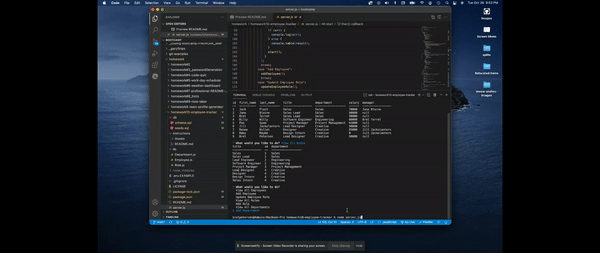

# employee-tracker

Homework#10 - Employee Tracker

## what did I do?

This assignment included making an application to track employees, roles, salaries, managers, and IDs. The application utilizes databases to store it's information. The user can add, update, and delete items within the application.

## what do I need to explain

Many of the requirements for this project were met. Manager functionality was only partially completed. Some of the table exports are not ideally represented. I was able to get fairly far without producing errors.

## video walk through

https://drive.google.com/file/d/1bpMOwIGcxTqNjipsJD2dZGo4lWD7d_C6/view?usp=sharing

## screenshot of final product

